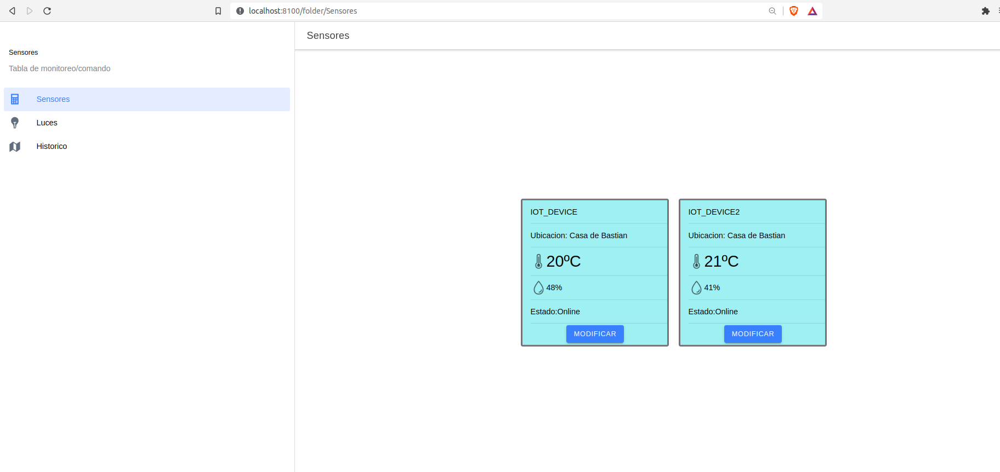
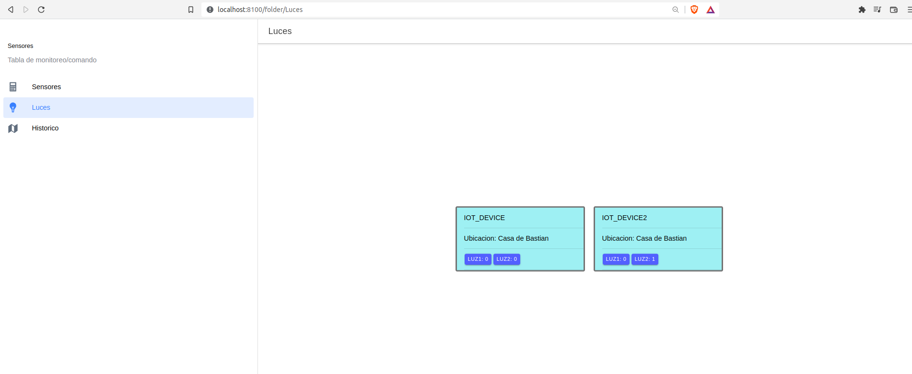
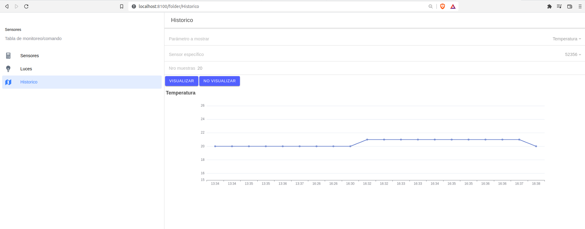
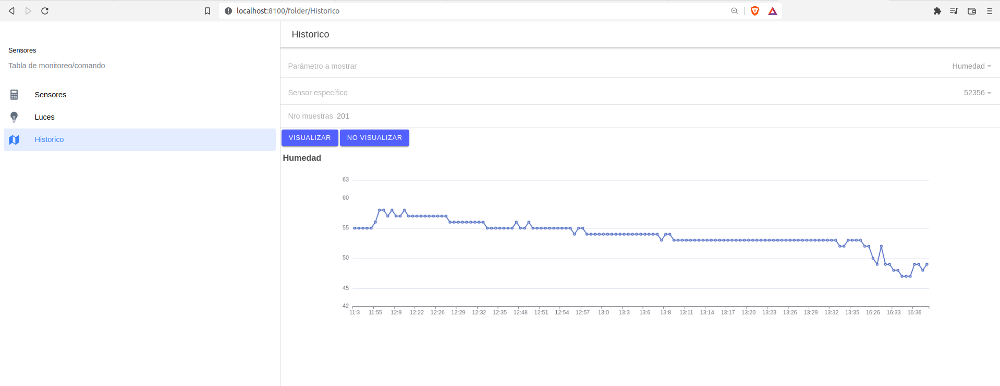

# tpDaIOTfront
Repositorio con el Front end de ejemplo para desplegar una aplicación IoT utilizando Mongo+Node+MQTT. Tecnología utilizada IONIC/angular

Pasos a seguir luego de clonar el repositorio en nuestro equipo de desarrollo:
1) Instalar las dependencias ejecutando el comando: \
`npm install` 
2) Para observar en el navegador:\
`ionic serve`

# Descripcion del front:
## Layout:
Contiene 3 solapas desde donde se puede seleccionar la accion.
### Sensores:
Se presentan los nodos con sus ultimas mediciones.

### Luces:
Se presentan los dispositivos 2 pulsadores que permiten encender o apagar los leds de los nodos.

### Histórico:
Se permite visualizar en una gráfica los distintos valores que se fueron almacenando en la base de datos.
#### Temperatura:

#### Humedad:

# Mejoras para realizar:
* Mejorar la visualización de los parámetros. 
* Integrar los  pulsadores a las tarjetas de los dispositivos.
* Utilizar un logueo para impedir que usuarios cuyos permisos no correspondan no puedan visualizar los datos.